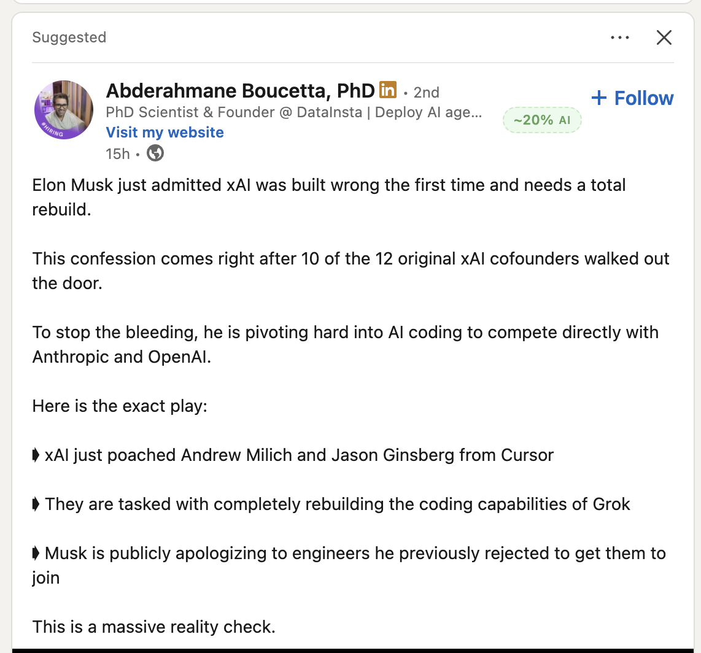

# RealFeed

**Spot AI-generated content instantly on LinkedIn — 100% local, no data sent anywhere.**

RealFeed is a Chrome extension that adds a small AI-probability badge next to every LinkedIn post. As you scroll, each post is analyzed in real time using a multi-layer detection pipeline running entirely inside your browser.

---

## Screenshot

<!-- Replace with actual screenshot -->


---

## Features

- **Inline badge** — score appears right next to the post author, color-coded green / yellow / red
- **Lazy evaluation** — posts are only analyzed when they scroll into view, not all at once
- **Two-phase scoring** — a fast heuristic score appears in ~1 second; an optional ML score refines it
- **Image analysis** — EXIF metadata inspection + spectral frequency analysis for GAN/diffusion artifacts
- **Optional ML layer** — DistilBERT (text) and EfficientNet-Lite (images) via ONNX Runtime Web
- **Smart caching** — results cached locally for 7 days; each post is analyzed only once
- **Privacy first** — zero network requests, no accounts, no telemetry

---

## How Scoring Works

| Score | Color | Meaning |
|-------|-------|---------|
| 0–35% | 🟢 Green | Likely human-written |
| 36–65% | 🟡 Yellow | Mixed signals |
| 66–100% | 🔴 Red | Likely AI-generated |

A **dashed border** means the score is preliminary (heuristics only, ML still pending or unavailable).
A **solid border** means the score is final.

### Detection layers

**Text analysis**
- Sentence burstiness and length variance
- Type-Token Ratio (TTR / MATTR) — vocabulary diversity
- Sentence-starter diversity
- Punctuation profile
- Word-length distribution
- Character Shannon entropy
- 70+ weighted AI phrase detection ("delve into", "paradigm shift", etc.)
- Hedging and transition density
- LinkedIn-specific structure detection (hook openings, numbered lists)
- Emoji / hashtag clustering
- Repetition detection

**Image analysis**
- EXIF/metadata inspection — detects AI generation software tags
- 2D FFT spectral analysis — GAN and diffusion-model frequency fingerprints

**ML layer (optional)**
- DistilBERT INT8 — text classification
- EfficientNet-Lite0 INT8 — image classification
- Runs via ONNX Runtime Web (WebAssembly, no GPU required)

---

## Installation (Developer Mode)

1. Clone the repo
   ```bash
   git clone https://github.com/d-srajan/realfeed.git
   cd realfeed
   ```

2. Install dependencies and build
   ```bash
   npm install
   npx webpack --mode development
   ```

3. Load in Chrome
   - Open `chrome://extensions`
   - Enable **Developer mode** (top right)
   - Click **Load unpacked** → select the `dist/` folder

4. Navigate to [linkedin.com/feed](https://linkedin.com/feed) — badges appear automatically

---

## Adding ML Models (Optional)

Without model files, the extension works using heuristics only (still accurate for most posts).
To enable the full ML pipeline:

```bash
pip install optimum[onnxruntime] transformers

# Text model (DistilBERT fine-tuned for AI detection)
python training/text/export_onnx.py

# Image model (EfficientNet-Lite fine-tuned for AI image detection)
python training/image/export_onnx.py
```

Place the exported `.onnx` files in `extension/models/` then rebuild.

---

## Development

```bash
# Development build (with source maps)
npx webpack --mode development

# Production build (minified, for Chrome Web Store submission)
npx webpack --mode production

# Run tests
npm test
```

### Project structure

```
extension/
  manifest.json
  content/
    content-script.js   # MutationObserver + IntersectionObserver + badge injection
    badge.js            # Inline badge UI (plain DOM, no custom elements)
    detail-panel.js     # Click-to-expand score breakdown panel
  background/
    service-worker.js   # Message orchestrator
    analysis-queue.js   # Concurrency, debounce, timeouts, caching
    text-detector.js    # Statistical + linguistic analysis pipeline
    image-detector.js   # EXIF parser + FFT spectral analysis
    model-loader.js     # ONNX Runtime Web loader + tokenizer
    ensemble.js         # Combines heuristic + ML scores
    video-detector.js   # Placeholder (Phase 6)
  utils/
    linkedin-selectors.js  # Centralized DOM selectors
    cache.js               # IndexedDB wrapper (FNV-1a hash, 7-day TTL)
    stats.js               # Shared statistical helpers
  popup/
    popup.html / popup.js / popup.css   # Settings UI
  icons/
  models/              # ONNX model files (not committed — add manually)
training/
  text/                # PyTorch training + ONNX export scripts
  image/               # PyTorch training + ONNX export scripts
store/                 # Chrome Web Store assets and submission checklist
```

---

## Privacy

RealFeed makes **zero external network requests**. All analysis runs locally in your browser using WebAssembly. No data about you or your LinkedIn feed ever leaves your device.

Permissions used:
| Permission | Purpose |
|---|---|
| `storage` | Save settings and local analysis cache |
| `host_permissions: linkedin.com` | Inject badges and read post content for local analysis |

---

## Roadmap

- [ ] Video analysis (motion consistency, compression artifacts)
- [ ] Per-signal score breakdown on badge click
- [ ] Support for other platforms (Twitter/X, Bluesky)
- [ ] User feedback loop to improve heuristic weights
- [ ] Bundled lightweight model (~5MB) for offline ML scoring

---

## License

MIT
